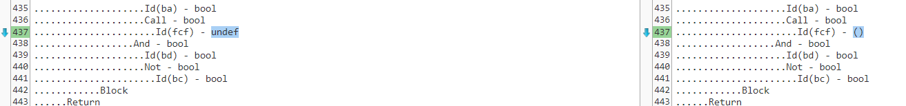
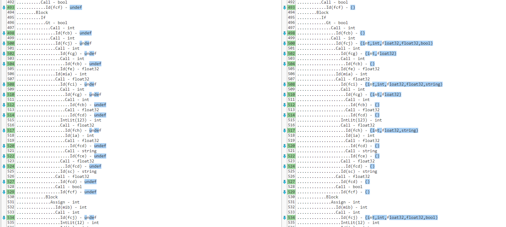

ESQUERDA: nosso output 
DIREITA: output do prof

  
errors_parseargs

  

--> no 1º erro, tens "undef" em vez de "string". Esse género de erro (aparecer "undef") surge em vários ficheiros, verifica que estás a ter os tipos certos em vez de "Undef".

---

  
factorial

  

---

  
valid_program1

  

  
valid_program2

  

  
valid_program3

  

  
valid_program4

  

  
valid_program5

  

  
valid_program6

  

  
valid_program7

  

  
valid_program8

  

  
valid_program9

  

---

  
variable_func_assign_errors

  

---

  
variable_func_symtab_aast1

  

  
variable_func_symtab_aast2

  

  
variable_func_symtab_aast3

  

  
variable_func_symtab_aast4

  

  
variable_func_symtab_aast5

  

